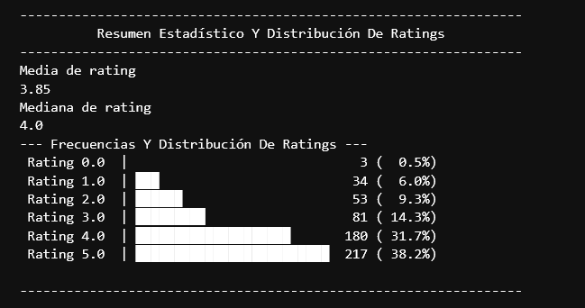

# Reto 1
---
## Partes del Reto:

### 1. Planteamiento

En este reto la mision era tratar el dataset de *** resenas_flowapp.csv *** y tomar las reseñas de esa empresa ficticia y procesarlas y convertirlas en un resumen estadistico, sin olvidar tecnicas de limpieza de datos, de las cuales nos expusieron:

- Procesar los valores nulos
- Ratings invalidos 
- Valores duplicados

Donde debiamos simplemente aplicar diferentes tecnicas:

- Limpieza de texto
- Calculo de las palabras mas mencionadas o frecuentes

---
### Solucion planteada y librerias utilizadas

#### Limpieza
Para el tema de la solucion opte por la limpieza de los datos en primer lugar, donde:

- Elimine registros duplicados con la funcion nativa de pandas
- normalice el texto a formato utf-8 para eliminar los acentos u tildes
- Organizar los valores del rating, ya que habian valores que no concordaban con el rango que deberia estar estipulado, entonces aqui use 2 tecnicas:
    1. Libreria de *word2number* para transformar algun texto que mencionara un numero al numero en concreto
    2. Eliminar valores que no representaban ni un numero u nulos para no sesgar la informacion
    3. Eliminar signos de puntuacion ya que habian algunos signos de puntuacion que se encontraban directamente pegados a la palabra, asi que utilice la libreria *string* para quitar las comas (,), puntos (.), etc.

---
#### Resumen estadistico

En esta parte lo que me correspondi a realizar:
 1. Busqueda de las palabras mas frecuentes por rating, lo cual fue algo que me costo demasiado porque no sabia si habia alguna libreria especifica para la busqueda, a la cual encontre una llamada *collections*, especialmente **counter** que me ayudaba a contar la frecuencia con la que se repetia una palabra por rating.

 2. Calculo de las medidas de tendencia central de rating, como antes habia hecho el calculo de la moda, aqui ya tocaba tratar los valores numericos, conociendo asi la distribucion de los rating, la media y la mediana. Aqui paso algo interesanto porque no sabia ni tampoco queria suponer si debia organizar una grafica usando la libreria de matplotlib o seaborn para expresar las frecuencias, pero preferi mejor optar por una grafica generada en la terminal de forma efectiva.

Esta seria una pequeña visualizacion de la grafica:

 
*Nota:* No muestra todo el output del codigo en esta imagen

## Librerias utilizadas

1. *word2number*.
2. *pandas*.
3. *numpy*.
4. *unicodedata*.
5. *Counter* de collections.
6. *string*.
 